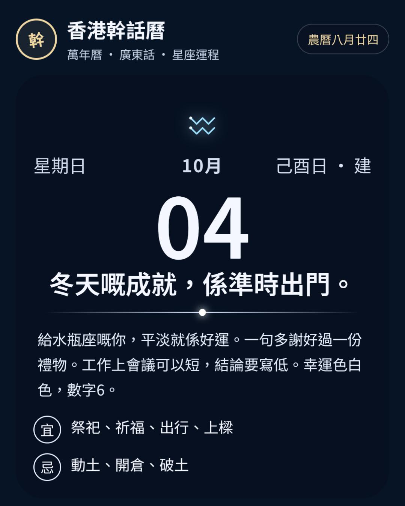

# 香港幹話曆

離線香港萬年曆。每日一句原創廣東話幹話，加上農曆、節氣、香港公眾假期、星座運程同通勝宜忌。

唔係煦暖曆，亦唔係任何賣緊嘅幹話曆。幹話係原創。星座運程係玩味文字，唔係天文預測。

## 畫面

## 功能

- 1901–2099 萬年曆
- 廣東話幹話
- 農曆、干支、二十四節氣
- 香港公眾假期（跟《公眾假期條例》一般補假規則）
- 先揀星座，每日顯示該星座運程、幸運色同數字
- 通勝宜忌：按農曆月支同當日干支計建除十二神（建、除、滿、平、定、執、破、危、成、收、開、閉），隔日唔同
- 全螢幕星空背景同星座線條圖示
- 桌面小工具：顯示今日日期、星期同幹話，撳一下打開日曆。系統大約每 30 分鐘自動更新一次；加落主畫面或打開 App 時會即時更新
- 收藏同分享，資料只放喺部手機

## 網頁版

GitHub Pages 由 `main` 分支根目錄 `/` 發佈：

https://terrytse123.github.io/hk-ganhua-calendar/

根目錄嘅 `index.html`、`calendar.js`、`data.js` 先會出現喺頁面。`www/` 同 `docs/` 係同一套源碼副本，唔係 Pages 來源。

## Android

已簽名 APK 喺 [Releases](https://github.com/terrytse123/hk-ganhua-calendar/releases)。而家最新係 [v4.7](https://github.com/terrytse123/hk-ganhua-calendar/releases/tag/v4.7)，包括天氣、透明度、星座運程同自訂背景嘅桌面小工具。長按小工具先出現「設定」。轉星座後小工具會即時更新。Android 7 或以上，允許呢個來源安裝。

源碼係一個 WebView 殼：

- `android/AndroidManifest.xml`
- `android/src/com/ganhua/calendar/MainActivity.java`
- 網頁檔放喺 `assets/www/`

套件名 `com.ganhua.calendar`。

## 假期同通勝說明

標示嘅係一般公眾假期，包括星期日補假順延。某一年政府憲報如果另有指定，可能差一日。冬至只當節氣；法定假日入面冬至定聖誕由僱主二揀一。

農曆同節氣用通用算法，跨日邊界可能差一日。宜忌用通勝建除規則，同某本紙通勝可能差一兩項。
